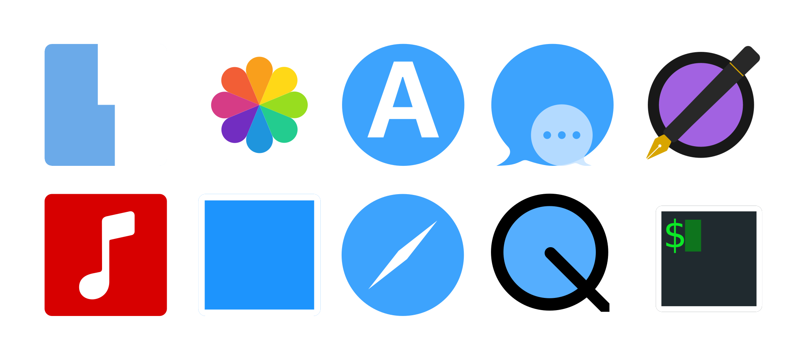

<!-- Please be careful editing the below HTML, as GitHub is quite finicky with anything that looks like an HTML tag in GitHub Flavored Markdown. -->

  

  <h1>geoOS—geometric icons for macOS</h1>

Each icon is based on a rounded square or circle. The icons use SF Symbols where applicable e.g. contacts.

The source folder contains the Affinity Designer files for the folders and apps. Each icon is on a layer in the respective document, this allowed me to more easily compare them while making them.

## Todo
- [ ] Create a styleguide and a proper grid so that the designs are more consistent.
